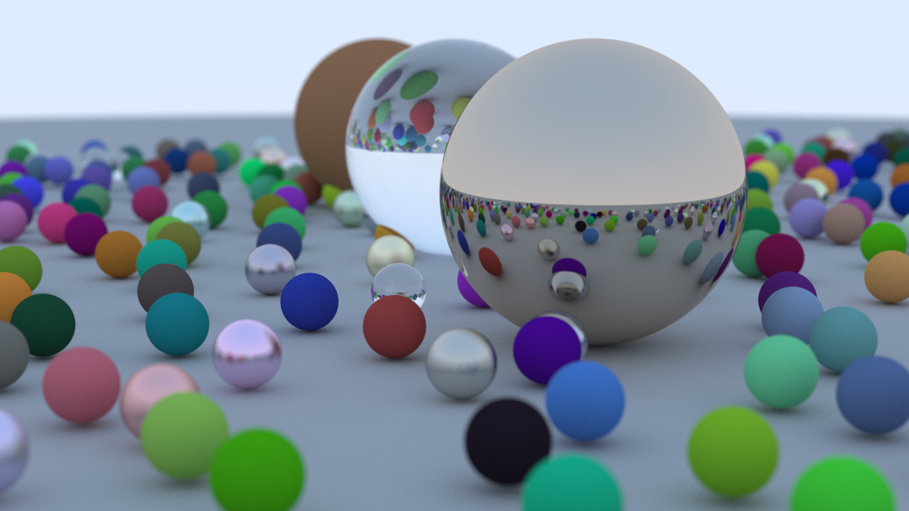
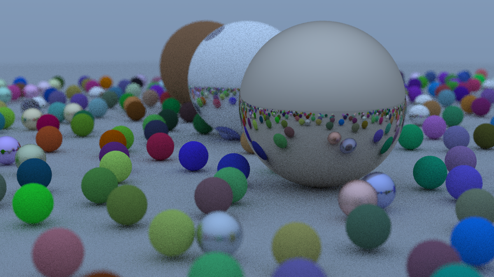

# Description
Yet another rust implementation of [_Ray Tracing in One Weekend_](https://raytracing.github.io/books/RayTracingInOneWeekend.html). This is the rendered example for depth 50 and 500 samples per pixel:

And the another render run for depth 50 and 10 samples per pixel:

# Todo list
- [ ] command line parameters for depth, samples per pixel and file name
- [ ] re-write Vec3d with non-reference func params
- [x] implement traits on operators for Vec3d
- [ ] make Color and Point3d to be convertible to/from Vec3d
- [ ] investigate non-clonable approach to programming

# Performance tracking
- 29.04.2025 - Image width 1200, max depth 50, sample per pixel 500, ttr - 11555s (~ 03:12:36) - DEBUG MODE!!!
- 29.04.2025 - Image width 1200, max depth 50, sample per pixel 10, ttr - 240s (~ 00:04:00) - DEBUG MODE!!!
- 29.04.2025 - Image width 1200, max depth 50, sample per pixel 10, ttr - 323s (~ 00:05:23) - DEBUG MODE!!!
- 03.05.2025 - Image width 1200, max depth 50, sample per pixel 10, ttr - 380s (~ 00:06:20) -  70s Release
- 03.05.2025 - Image width 1200, max depth 50, sample per pixel 10, ttr - 293s (~ 00:04:53) -  60s Release
- 03.05.2025 - Image width 1200, max depth 50, sample per pixel 50, ttr - 1800s (~ 00:30:00) - 308s Release
- 04.05.2025 - Image width 1200, max depth 50, sample per pixel 10, ttr - 224s (~ 00:03:44) - 46s Release

