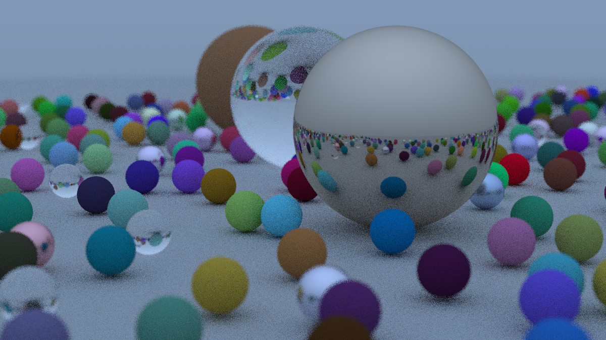

# Description
Yet another rust implementation of [_Ray Tracing in One Weekend_](https://raytracing.github.io/books/RayTracingInOneWeekend.html). This is the rendered example for depth 50 and 500 samples per pixel:

And the another render run for depth 50 and 10 samples per pixel:

# Todo list
- [ ] balance the threads - spread the load not by fixed chanks of the image, but run small chanks over fixed threads. In that way there will be no threads that already finished doing nothing and one thread chewing complex chunk
- [ ] command line parameters for depth, samples per pixel and file name
- [ ] re-write Vec3d with non-reference func params
- [x] implement traits on operators for Vec3d
- [ ] make Color and Point3d to be convertible to/from Vec3d
- [ ] investigate non-clonable approach to programming

# Performance tracking
- 29.04.2025 - Image width 1200, max depth 50, sample per pixel 500, ttr - 11555s (~ 03:12:36) - DEBUG MODE!!!
- 29.04.2025 - Image width 1200, max depth 50, sample per pixel 10, ttr - 240s (~ 00:04:00) - DEBUG MODE!!!
- 29.04.2025 - Image width 1200, max depth 50, sample per pixel 10, ttr - 323s (~ 00:05:23) - DEBUG MODE!!!
- 03.05.2025 - Image width 1200, max depth 50, sample per pixel 10, ttr - 380s (~ 00:06:20) -  70s Release
- 03.05.2025 - Image width 1200, max depth 50, sample per pixel 10, ttr - 293s (~ 00:04:53) -  60s Release
- 03.05.2025 - Image width 1200, max depth 50, sample per pixel 50, ttr - 1800s (~ 00:30:00) - 308s Release
- 04.05.2025 - Image width 1200, max depth 50, sample per pixel 10, ttr - 224s (~ 00:03:44) - 46s Release
- 25.05.2025 - Image width 1200, max depth 50, sample per pixel 10, ttr -  98s (~ 00:01:38) - 20s Release - 4 threads
- 25.05.2025 - Image width 1200, max depth 50, sample per pixel 10, ttr -  69s (~ 00:01:09) - 13.3s Release - 8 threads
- 25.05.2025 - Image width 1200, max depth 50, sample per pixel 10, ttr -  54s (~ 00:01:09) - 10.3s Release - 16 threads
- 30.08.2025 - Image width 1200, max depth 50, sample per pixel 10, ttr -  44.2s (~ 00:01:09) - 4.8s Release - 16 threads
- 14.09.2025 - Bounding box implemented, but no change in performance... 
- 19.09.2025 - So indeed bounding box is faster with more objects involved :)
    - 1928 objects, 95s vs 46s
    - 4818 objects, 258 vs 51s
